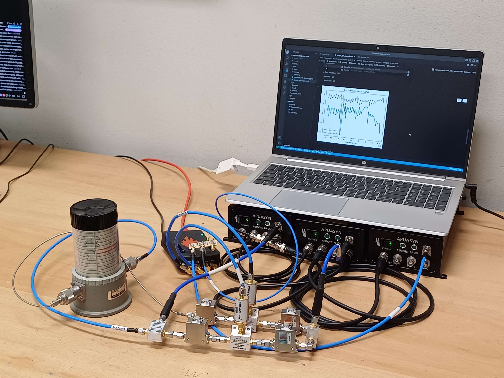

# SteeleLab Vector Network Analyser

## Introduction
The SteeleLab Vector Network Analyser (SLVNA) is a modular and open source vector network analyser for measuring $S_{21}$ of microwave devices. It was designed for [SteeleLab](https://steelelab.tudelft.nl/), a research group at the Delft University of Technology studying quantum circuits and mechanics, by a [team of six bachelor students](#contributors) as their graduation project for the BSc Electrical Engineering at the same university.

## System description
The goal of the project was to create a VNA to measure the $S_{21}$ parameter of the quantum circuits created by SteeleLab that is cheaper and more modular than commercial options. To this end the SLVNA is built completely out of commercial-off-the-shelf components and the software is fully open source. Both the server and client software are written in Python for easy modification and extension.

The interface to the SLVNA is an instance of the `SLVNA` class described in [api.py](project\client\application\api.py) which is instantiated and configured locally, after which it can be instructed to perform a sweep. At that point the client connects to the microwave generators and the Red Pitaya board over the local network, configures them appropriately and instructs them to perform the sweep which is executed by the hardware. The results are communicated back from the Red Pitaya to the client as they come in, where they are processed and returned to the user.

## Setup instructions
See [docs/hardware/hardware.md](docs/hardware/hardware.md) for instructions on building the required hardware setup.

See [docs/install/server.md](docs/install/server.md) for instructions on preparing the Red Pitaya board.

See [docs/install/client.md](docs/install/client.md) for an explanation on how to install the client software.

See [docs/example/simple_api_usage.ipynb](docs/example/simple_api_usage.ipynb) for an example of how to use the API.

## Contributors
This project was started as a graduation project for the bachelor study Electrical Engineering at the TU Delft. During a period of ten weeks, under the supervision of Gary Steele, the following students have developed large parts of the hardware and software:

- Ruben Dirkzwager & Samet Öztürk (RF team) ([thesis](https://repository.tudelft.nl/record/uuid:3052573c-9115-4de4-85e5-80daba10a0aa));
- Anne Hinrichs & Maarten Oudijk (FPGA team) ([thesis](https://repository.tudelft.nl/record/uuid:1396c8d7-07e5-40b7-bc41-a43a4df044b1));
- Matthijs Langenberg & Simon Schaap (software team) ([thesis](https://resolver.tudelft.nl/uuid:252fb2a3-d0ed-47e0-987d-83c8590953f0)).

After the graduation project ended, Matthijs Langenberg and Maarten Oudijk have completed and prepared for public release the first version of hardware and software in this repository.