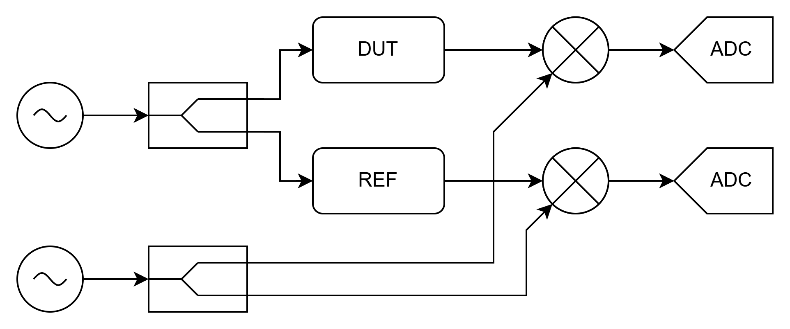
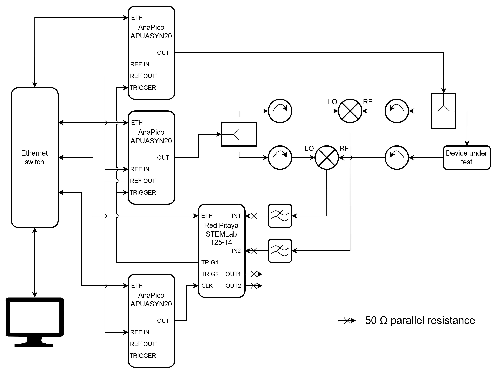
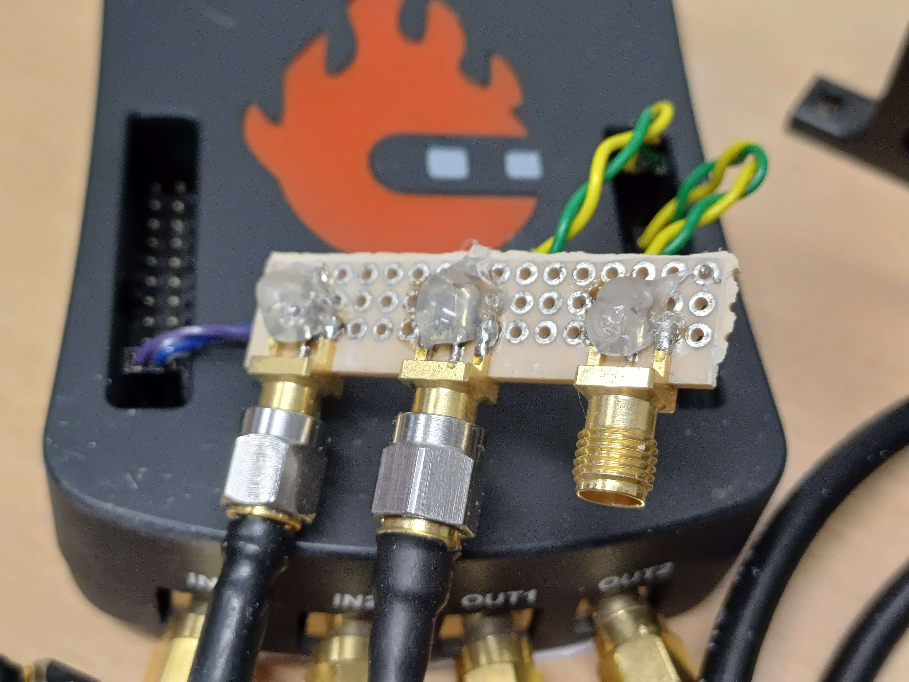

# Hardware

## Introduction and theory
Vector Network Analysers consist of several physical parts including microwave generators, up- and downconverters, and data acquisition. 

The diagram above shows a simplified view of the hardware components of a simple VNA capable of measuring the $S_{21}$ parameter of a device. First, an RF wave is generated by a microwave generator. This signal is split and passed through the Device Under Test (DUT) and a reference channel (REF). In the DUT the amplitude and phase of the wave are modified according to the device's $S_{21}$ parameter which is the information that should be extracted by the VNA. The two paths then both have an analogue mixer where they are downconverted using a signal from a second microwave generator which is set to the RF frequency plus some low intermediate frequency as local oscillator, meaning the resulting signals will be of that intermediate frequency. Those two low frequency signals are then digitised and the amplitude and phase are extracted digitally.

The key detail exploited in this design is that frequency downconversion preserves the amplitude and phase information present in the original signal but transplants it onto a wave of a different frequency. This allows the signal at the input of the ADCs to be at a relatively low fixed frequency which increases accuracy and reduces cost.

## Parts
This project implements the basic system described above using generic off-the-shelf components to improve modularity, lower costs and to make reproduction easier. The exact parts used during development are:

- 3x Anapico APUASYN20, microwave generator
- 1x Red Pitaya STEMLab 125-14 External Clock, RF development board
- 1x Computer/laptop
- Ethernet infrastructure
- 2x Minicircuits ZFRSC-183-S+, 18GHz resistive splitter
- 4x Aerotek H60-1L1FF, 4-8GHz isolator
- 2x Minicircuits ZMX-8GH, 3.7-8GHz mixer
- 2x Minicircuits SLP-10.7+, 11MHz low-pass filter
- 2x SMA M-M elbow coupler
- 5x SMA M-M straight coupler
- 2x SMA M-F-F tee
- 4x SMA 50 ohm terminator
- 8x SMA M-M cable
- 2x SMA F to 2.54mm pinheader F (custom-made)
- 3x BNC M-M cable
- 1x BNC M-F-F tee
- 1x SMA F to BNC M

Note that the exact parts were largely dictated by what was easily available in the relatively short project period, the setup can very much be optimised. A prime example of this is the use of a third microwave generator solely to drive the 125MHz clock input of the Red Pitaya. This is obviously overkill, and better solutions are described in the section [Clocks](#clocks) below.

Different microwave generators than this specific model can be easily used by just writing a simple 'driver' class for it and passing an instance to the VNA class during creation. The base class can be found in [project\client\generator\base_controller.py](project\client\generator\base_controller.py).

The Red Pitaya board used during development was actually the standard version of the STEMLab 125-14 modified to accept an external clock. This is functionally identical to the STEMLab 125-14 External Clock sold by Red Pitaya.

## Setup

The diagram above shows the complete hardware setup used during the development of this project, including all inter-component connections. Compared to the simple diagram above there are some additional components and signals. First there are isolators placed on the inputs of the mixers to mitigate reflections on these ports. The isolators improve the impedance matching of the mixer input ports, and also block remaining reflections from propagating back to the signal sources. Secondly, there are low-pass filters on the outputs of the mixers to remove the sum frequency component they also produce. This is because the ADCs on the Red Pitaya cannot handle these extremely high frequencies. Lastly the diagram shows the trigger, clock reference and ethernet control signals between the different components.

Important to note is that the Red Pitaya STEMLab 125-14 External Clock board has high impedance RF inputs, so SMA tees with 50 ohm terminators are used to match the output of the low-pass filters. The inputs of the board are set to their low voltage mode which allows $\pm$ 1 volt at the input. The outputs of the board also need to be terminated as they output into a high impedance load, namely the air.

The trigger outputs and clock input of the Red Pitaya board are exposed on the expansion ports E1 and E2 which are 13x2 2.54mm pinheaders. These require a special adapter to convert to SMA shown below. They do not require impedance matching in our testing.

## Red Pitaya inputs and outputs
### Analogue I/O
The Red Pitaya STEMLab 125-14 External Clock board used for this project has two RF Analogue-to-Digital Converters and two RF Digital-to-Analogue converters, both running at a sample rate of 125 MHz and a bitdepth of 14 bits.

The ADCs are used to input the intermediate frequency signals coming from the Device Under Test and REFerence arms of the analogue circuit. The final output data of the VNA is the absolute and relative parameters of these two waves. The signal input here should match the configured intermediate frequency (IF) and have an amplitude of at most 10 dBm or $\pm$ 1 volt, otherwise the ADCs will clip.

In the current overlay version the DACs continuously output 10 MHz cosine and sine signals at 10 dBm or $\pm$ 1 volt, an artefact from when these were supposed to be used as reference for the microwave generators. These outputs can still be used to lock other instruments, though it is not recommended. The DACs can be reassigned to output another signal by modifying the overlay, see [docs/hardware/overlay.md](overlay.md) for more details about doing this.

### Digital I/O

Besides the four RF inputs/outputs, the Red Pitaya STEMLab 125-14 External Clock board also has two expansion headers, E1 and E2, that contain digital inputs and outputs. The pinout of these headers can be found in the [board documentation](https://redpitaya.readthedocs.io/en/latest/developerGuide/hardware/125-14_EXT/top.html#pinout) and the [common hardware specifications](https://redpitaya.readthedocs.io/en/latest/developerGuide/hardware/hw_specs/extent.html#extension-connector-e1).

The external clock has to be connected to pin 23 and 24 of the [E2 header](https://redpitaya.readthedocs.io/en/latest/developerGuide/hardware/hw_specs/extent.html#extension-connector-e2). Many types of clock signal are supported as described in the [board documentation](https://redpitaya.readthedocs.io/en/latest/developerGuide/hardware/125-14_EXT/top.html). For this project the frequency must be 125 MHz and this must be locked to the frequencies generated by the microwave generators as described in section [Clocks](#clocks). The input is AC coupled and has a 100 ohm termination on the board. During development we used a microwave generator to generate a 10 dBm or $\pm$ 1 V sinusoid which was connected directly to the clock input which has worked flawlessly. Note that attempting to run the VNA without an external clock will hang! This is because the server cannot detect the lack of a clock in the Programmable Logic (PL) part of the SoC and so will keep waiting for the next point of data that will never be generated.

The [E1 header](https://redpitaya.readthedocs.io/en/latest/developerGuide/hardware/hw_specs/extent.html#extension-connector-e1) contains general purpose IO pins used for various digital outputs of the overlay. The DIOx_N pins are all continously pulled low so they can be used as a ground for the corresponding DIOx_P pin that carries the actual signal. All pins are 3.3 V CMOS/TTL outputs. The LEDs 0 through 7 on the board are linked directly to their corresponding DIOx_P pin and can be used for quick visual debugging.

- DIO0_P: Trigger 1 output: trigger signal for the RF generator;
- DIO1_P: Trigger 2 output: trigger signal for the LO generator;
- DIO2_P: Accumulator trigger: indicates when data is actually being accumulated within each point. Exposed mainly for debugging;
- DIO3_P: Reset/acquire: high when the overlay is active and running a sweep. Exposed mainly for debugging;
- DIO4_P: FIFO overflow: error state indicating points are being acquired faster than they can be read by the server. If this is high the IFBW should be decreased!
- DIO5_P and DIO6_P: unused in the current overlay version;
- DIO7_P: 10 MHz output: a digital version of the 10 MHz output from the DACs.

## Clocks
One thing that is critical to get right is that all used frequencies are fixed at known ratios to each other. This is both to make sure the frequency axis of the data has good (or at least known) absolute accuracy, but also because the signal processing done on the Red Pitaya requires that its internal oscillator is exactly the same frequency as the incoming signal which in turn depends on the frequency difference between the two microwave generators.

Most laboratory RF equipment has a reference input which allows the user to supply one single clock all the other clocks will be derived from. Unfortunately the used Red Pitaya board does not have such an input which means the synchronisation is more complicated. The initial idea was to consider the clock in the Red Pitaya the main clock and to have the board generate a 10 MHz reference signal for the microwave generators using the on-board DAC. While this works in theory, in practice it turns out that the clock on the STEMLab boards is accurate to only about 10 ppm which is too loose for the Anapico APUASYN20 generators to consider it as a valid reference signal and so they refuse to lock to it.

The solution used during development is to consider the APUASYN20 used as the RF generator to be the main clock and cascade its reference output, through the LO generator, to a third generator that is configured to output a fixed 125 MHz clock. The Red Pitaya board was then modified to disconnect the internal 125 MHz oscillator and instead expose the clock inputs it was driving through the expansion port, which effectively turns the board into the external clock version also sold by Red Pitaya. This new clock input could then be connected to the fixed generator to lock the components on the Red Pitaya board. This solution is obviously very wasteful as there are much cheaper ways to generate a locked 125 MHz clock but this was the best solution that was immediately available during development.

A better long term solution would be to create a dedicated circuit board that includes a PLL chip to turn a 10 MHz reference into the required 125 MHz clock. It is also possible to use a simpler circuit to turn the 10 MHz sine wave most commonly used as reference into a TTL signal that is then input into the PL through a digital input to use its internal clock circuitry to generate the required 125 MHz clock. This can then be fed into the board's clock input with a jumper cable or by modifying the board to directly take the clock from the PL as documented by [Red Pitaya themselves](https://redpitaya.readthedocs.io/en/latest/developerGuide/hardware/125-14/top.html#external-adc-clock).

It was also noted during development that the process of clock reference locking is finicky. The current version of the API implements basic reference lock configuriation and checking. However, it is recommended to also manually configure and test the locking to prevent surprises.

The result of insufficient clock synchronisation is mainly reduced accuracy of the frequency axis and an increase in noise for lower IFBW (instead of the expected decrease). The exact reasons for this last effect are described in the [thesis of the FPGA subteam](https://resolver.tudelft.nl/uuid:1396c8d7-07e5-40b7-bc41-a43a4df044b1).

## Suggested improvements
The biggest point of interest about the hardware of this project is characterising and improving its RF performance. Currently it can be demonstrated to work by measuring known test loads such as tunable cavities and finding their recognisable features in the output. Unfortunately there are currently many artefacts in the measurements that are not modelled which make looking for unknown features much harder. It appears a major factor is the different synthesis strategies the microwave generators use over the covered frequency range. There are also standing wave effects and non-linearities in other components that need to characterised, modelled, and compensated for to achieve a truly useful accuracy.

Besides performance, usability can also be improved by developing a way to package the RF hardware and Red Pitaya board together in a single unit with all the required external connections exposed as standard connectors on a single panel. This could also include making a small 'hat' circuit board for the Red Pitaya board that sits on the expansion connectors to break out the required pins as SMA and/or perform clock conversion as mentioned in section [Clocks](#clocks) above.

Lastly, it would be possible to add better power control so two-dimensional sweeps can be performed. Currently the RF generator can be configured for different power levels but this affects the level at the ADC inputs and so they are not being optimally utilised. Besides this the power range of microwave generators generally is not very wide, only 33 dB for the used APUASYN20. This could be improved by using a digitally controlled variable attenuator at the output of the RF generator and corresponding variable amplifiers (or fixed amplifier followed by a variable attenuator) after the DUT and REF arms. Note that while the attenuator can be shared, the amplifiers cannot so care needs to be taken to pick two matching units.