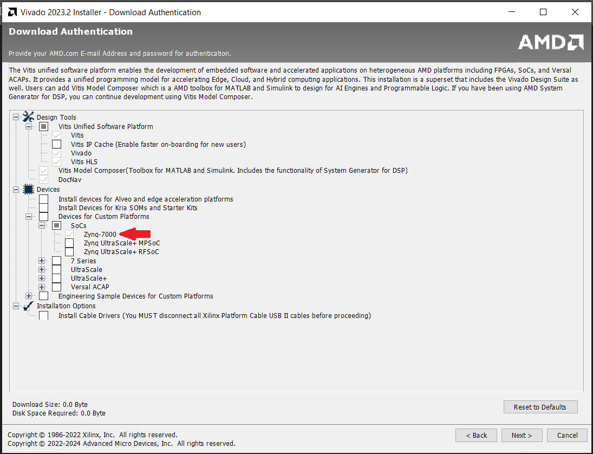
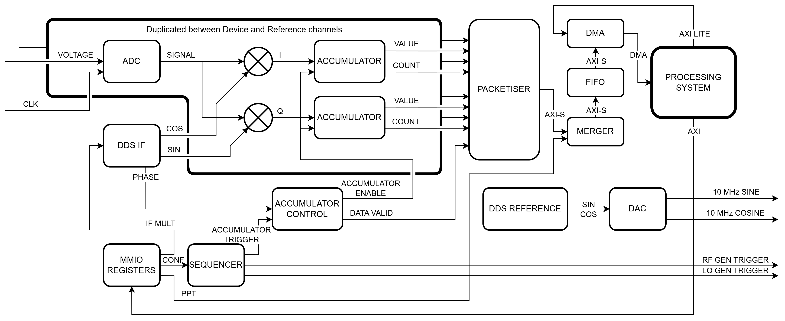

# Overlay

## Introduction
The hardware of the VNA as described in [docs/hardware/hardware.md](hardware.md) includes a Red Pitaya STEMLab 125-14 board which has as central component a Zynq-7010 System-on-Chip. This system includes both a conventional dual-core ARM processor named the Processing System (PS), but also gate fabric, like that found in FPGAs, referred to as Programmable Logic (PL). In this project the PL is used to implement real-time functionality such as the ADC driver, IQ decomposition, data accumulation, and sequencing logic. These functions can be configured from software running on the PS using Memory Mapped Input/Output registers (MMIO), and the data can be transferred to the PS through Direct Memory Access (DMA) for further processing and transmission to the client. Most of the detailed inner workings of the overlay are described in the [thesis of the FPGA subteam](https://resolver.tudelft.nl/uuid:1396c8d7-07e5-40b7-bc41-a43a4df044b1), though note that some features have been added or changed after this report was written.

The design implemented in the PL is referred to as the overlay. It is designed using a combination of the hardware description language Verilog and blockdiagrams in the IP integrator of the AMD/Xilinx Vivado software suite. The overlay description is then implemented by Vivado using the availble hardware on the chip and output as a bitstream file (.bit) and the associated hardware hand-off file (.hwh). The bitstream describes the configuration and connections of all the logic elements inside the PL and is loaded directly into the hardware. The hardware handoff file is loaded by the software that will be interacting with the overlay and describes parameters like memory maps and IO pins.

## Opening the Vivado project
The directory [project/overlay/](project/overlay/) contains all the necessary files to recreate the overlay including all the source files and the project configurations. To open the project in Vivado follow these steps:
- Download the [Vivado installer](https://www.xilinx.com/support/download/index.html/content/xilinx/en/downloadNav/vivado-design-tools/) from the AMD website. This project was created and tested in Vivado 2023.2 but it should be both forwards and backwards compatible.
- Follow all steps for installation in the installer. Make sure to select the software component for implementing on Zynq-7000 devices, none of the other options are required. Notes: installation requires an AMD account, and the software can take upwards of 80 GB of diskspace. 
- Copy the project files from the repository to an easily accessible location. The path to the location must be short and must not contain any spaces. A good location would be something like `C:\vivadoprojects\slvna\`.
- (Optional) Add additional cores from Pavel Demin's [Red Pitaya Notes repository](https://github.com/pavel-demin/red-pitaya-notes/tree/master/cores) to the `cores` directory in the project. The required cores are already included in this repository.
- Open Vivado and navigate the Tcl console (bottom left of the window) to the project directory using the command `cd $PROJECTDIR$`, replacing `$PROJECTDIR$` with the directory created in the previous step. Note that unlike the Windows convention the Tcl console only accepts forward slashes in paths. For the example location the command would be `cd C:/vivadoprojects/slvna/`.
- Run the command `source slvna.tcl` to synthesise all the IP cores, create and open a project with the correct settings and import the required source files. This will take about a half a minute and Vivado will switch screens automatically during the process. The message "SLVNA project ready to use!" appears in the Tcl console once complete.
- In Flow Navigator on the left click 'Generate Bitstream' and click 'OK' on the following windows to implement the design to `.bit` and `.hwh` files. After initialisation completes the process continues running in the background and a window will only show once completed. The status can be seen in the top right and the 'Design runs' tab of the bottom panel. It can take well over 15 minutes for the first run to complete, subsequent runs will be shorter.
- If generation was succesful a message will pop up asking to open the implemented design, click cancel.
- Copy the generated files `$PROJECTDIR$\slvna\slvna.gen\sources_1\bd\system\hw_handoff\system.hwh` and `$PROJECTDIR$\slvna\slvna.runs\impl_1\system_wrapper.bit` to the `/home/xilinx/bit` directory on the Red Pitaya. They should be renamed so their names match except for the extension. It is highly recommended to include a version number in the name.
- On the Red Pitaya, change the OVERLAY_PATH constant in `$SERVERREPO$/project/server/protocol.py` to the path of the new `.bit` file and restart the server. It will automatically find the `.hwh` file by assuming the same path and name but with the appropriate extension.

The server should now be running the newly implemented overlay. Without modification it should behave exactly like the pre-implemented version.

To add cores from the [Red Pitaya Notes repository](https://github.com/pavel-demin/red-pitaya-notes/tree/master/cores), put their `.v` files in the `$PROJECTDIR$\cores\` directory and run the command `source cores/build_cores.tcl` in the Tcl console to register them. This can take a couple minutes, and Vivado will switch between different screens and projects automatically during the process. You may have to use `cd` to change the working directory back to the root of the project.

## Block diagram

The diagram above shows a detailed overview of all the components and connections of the PL overlay. This is similar to the blockdiagram in the Vivado project, excluding low level infrastructure such as bit routing and AXI switching.

## Interacting with the overlay
The overlay can be interacted with using PYNQ. An example of basic interaction is shown in [docs/hardware/plt_simple.ipynb](plt_simple.ipynb).

### Memory map
The overlay can be configured from software using Memory-Mapped Input/Output registers (MMIO). In the current design this is a set of four 32-bit registers each mapped to a memory address with various bitfields. These can be written to using the MMIO class in the PYNQ module. The addresses and bitfields therein are described below.

0x42000000:
- \[31:0]: Deadtime per point in cycles (0-4,294,967,295 <> 0-34.36 s) (default 350 us)

0x42000008:
- \[31:0]: Total time per point in cycles (0-4,294,967,295 <> 0-34.36 s) (default 1 ms)

0x41200000:
- \[23:0]: Length of trigger pulse in cycles (0-16,777,215 <> 0-0.134 s) (default 10 us)
- \[24]: Trigger 1 invert (0 means active high/rising edge, 1 means active low/falling edge) (default 1)
- \[25]: Trigger 1 output first step (0 means don't, 1 means do) (default 0)
- \[26]: Trigger 1 output points (0 means don't, 1 means do) (default 1)
- \[27]: Reserved
- \[28]: Trigger 2 invert (0 means active high/rising edge, 1 means active low/falling edge) (default 0)
- \[29]: Trigger 2 output first step (0 means don't, 1 means do) (default 1)
- \[30]: Trigger 2 output points (0 means don't, 1 means do) (default 0)
- \[31]: Reserved

0x41200008:
- \[0]: Run/Reset (0 for reset, 1 for run) (default 0)
- \[15:8]: IF multiplier (IF=FCLK*val/256) (default 16 for IF=7.8125 MHz)
- \[31:16]: Points per DMA transfer (default 1)

### Direct Memory Access
The data is acquired using Direct Memory Access. Points are transferred in packets of 12 words, their meaning is described in [docs/hardware/plt_simple.ipynb](plt_simple.ipynb).